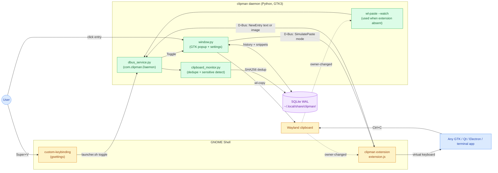

# Architecture

## Overview

Clipman is a Wayland-native clipboard manager built as two cooperating
processes: a GNOME Shell extension that detects clipboard changes
natively via `Meta.Selection`'s `owner-changed` signal, and a Python +
GTK3 daemon that persists history in a local SQLite database. The two
halves communicate over D-Bus on the session bus, so there is no
polling, no screen flicker, and no telemetry. A `wl-paste --watch`
fallback inside the daemon covers Wayland sessions where the extension
is not available.

## Process model

### Daemon

The daemon (`clipman.py` plus the `clipman/` package) is a single GTK
`Gio.Application` running on one GLib main loop. Python 3.10 through
3.12 are supported, with dbus-python and PyGObject providing the
runtime bindings. All clipboard ingest, database I/O, and GTK signal
handling happen on the main thread; SQLite access is intentionally
serialized through the loop (see the `check_same_thread=False` comment
in `clipman/database.py`).

The one exception is the optional update-check worker described in
[ADR 0007](docs/adr/0007-in-app-update-notifications.md): a background
thread performs the single anonymous HTTPS request and marshals its
result back to the UI through `GLib.idle_add`, so no GTK or D-Bus
state is touched off-thread.

### Extension

The GNOME Shell extension under `extension/` is an ES module that
loads inside the Shell's gjs process. It is compatible with GNOME
Shell 45 through 48. On clipboard `owner-changed` events the
extension reads the new content via a MIME-type fallback chain
(`text/plain;charset=utf-8` -> `UTF8_STRING` -> `text/plain` ->
`STRING`) and forwards it to the daemon over D-Bus. It also exposes
its own D-Bus surface for the daemon to invoke paste keystrokes and
popup placement (see [IPC contract](#ipc-contract) below).

### Fallback path

When the extension is absent (for example on KDE, Sway, or Hyprland,
or before the user has logged out and back in after install), the
daemon's `clipman/clipboard_monitor.py` spawns `wl-paste --watch` as
a subprocess and reads new clipboard contents through `wl-paste`. This
fallback runs only when the extension's D-Bus name is missing.

Under snap confinement, neither `wl-paste --watch` nor the in-shell
extension is reachable from inside the sandbox; snap users rely on
the GNOME Shell extension running in their host session and talking
to the snap-confined daemon over the session bus.

## Data model

The store is a single SQLite database at
`~/.local/share/clipman/clipman.db` opened in WAL journal mode. WAL is
used so the popup window can read history concurrently while the
daemon writes new entries arriving from D-Bus callbacks. The schema
lives in `clipman/database.py`:

- `entries` - clipboard history. Columns: `id`, `content_type`
  (`text` or `image`), `content_text`, `image_path`, `content_hash`
  (SHA256, `UNIQUE`), `pinned` (integer flag), `created_at`,
  `accessed_at`, `sensitive`. Pinning is a flag on this table, not a
  separate table. Indexes on `accessed_at DESC` and `content_hash`.
- `snippets` - user-defined named snippets with `id`, `name`,
  `content_text`, `created_at`.
- `settings` - key/value `TEXT` pairs for user preferences (max
  entries, theme, paste mode, update-check toggle, and so on).

Deduplication is content-addressed: every text or image payload is
SHA256-hashed before insert, and an existing row with the same hash is
bumped via `accessed_at` rather than duplicated. Image files are
written into `~/.local/share/clipman/images/` named by their hash, and
the daemon validates magic bytes (PNG, JPEG, GIF, BMP, WebP) before
persisting.

Filesystem permissions are enforced on every startup:

- Data directory and images directory: `0o700` (chmod re-applied on
  startup even if the directory pre-existed).
- Individual image files: `0o600` (created with `os.open` +
  `O_CREAT` and an explicit mode, not `open()`).

Sensitive entries detected by `clipman/clipboard_monitor.py` are
written with `sensitive = 1` and auto-deleted by
`delete_expired_sensitive` once they are older than 30 seconds.

## IPC contract

All IPC is on the session bus. Both interfaces are unauthenticated by
design - access is gated by the user's session bus, which is the same
trust boundary as GNOME Shell itself.

### Daemon

- **Bus name:** `com.clipman.Daemon`
- **Object path:** `/com/clipman/Daemon`
- **Interface:** `com.clipman.Daemon`
- **Implementation:** `clipman/dbus_service.py`

| Method                                | Signature    | Description                                                                                                                                                                                                       |
| ------------------------------------- | ------------ | ----------------------------------------------------------------------------------------------------------------------------------------------------------------------------------------------------------------- |
| `Toggle()`                            | `() -> ()`   | Toggles popup visibility. Used by the Super+V keybinding via `launcher.sh`.                                                                                                                                       |
| `Show()`                              | `() -> ()`   | Forces the popup visible.                                                                                                                                                                                         |
| `Hide()`                              | `() -> ()`   | Hides the popup.                                                                                                                                                                                                  |
| `Quit()`                              | `() -> ()`   | Exits the GTK application cleanly.                                                                                                                                                                                |
| `NewEntry(s content_type, s content)` | `(ss) -> ()` | Called by the extension (or by the `wl-paste --watch` fallback) when the clipboard changes. `content_type` is `text` or `image`; `content` is the UTF-8 text, or the empty string for images (which the daemon then reads through `wl-paste --type image/png`). |

### Extension

- **Bus name:** `org.gnome.Shell.Extensions.clipman`
- **Object path:** `/org/gnome/Shell/Extensions/clipman`
- **Interface:** `org.gnome.Shell.Extensions.clipman`
- **Implementation:** `extension/extension.js`

| Method                        | Signature   | Description                                                                                                                                                               |
| ----------------------------- | ----------- | ------------------------------------------------------------------------------------------------------------------------------------------------------------------------- |
| `SimulatePaste(s mode)`       | `(s) -> ()` | Simulates a paste keystroke through a Clutter virtual keyboard. `mode` is one of `auto`, `ctrl-v`, `ctrl-shift-v`, or `shift-insert`; unknown values fall back to `auto`. |
| `MoveWindowToCursor(s title)` | `(s) -> ()` | Moves the GTK popup window (looked up by `title`) to the current cursor position.                                                                                         |

The `SimulatePaste(s mode)` argument was added later; older
extensions exposed the no-argument shape. The daemon attempts the
modern signature first and silently retries without the argument on
`UnknownMethod`. The rationale and back-compat path are recorded in
[ADR 0005](docs/adr/0005-paste-mode-as-dbus-arg.md).

## Trust boundaries

Clipboard data never leaves the machine. Everything described in the
[Data model](#data-model) section is local-only: the SQLite database
lives in the user's home directory with `0o700` permissions, image
files are `0o600`, D-Bus traffic stays on the session bus, and no
subprocess is ever invoked with `shell=True`.

The daemon has exactly one network egress: an opt-out update check
documented in [ADR 0007](docs/adr/0007-in-app-update-notifications.md).
At most once every 24 hours, the update-check thread issues a single
anonymous `GET https://api.github.com/repos/MohammedEl-sayedAhmed/clipman/releases/latest`
with `User-Agent: clipman/<version>` and a 5-second timeout. No
request body, no query parameters, no cookies, no identifiers, no
referrers. The setting is default-ON for source, PyPI, and AUR
installs (where the user is responsible for updates), and default-OFF
for Snap and Flatpak (whose stores already push updates). Users can
toggle it under Settings -> Updates.

Sensitive content detection (tokens, secrets, password-like strings)
runs in `clipman/clipboard_monitor.py` before the entry is persisted.
Matching entries are flagged `sensitive = 1`, hidden from search where
appropriate, and auto-deleted from the database 30 seconds after
capture. Incognito mode pauses recording entirely.

No analytics, no crash reporting, no third-party services.

## Architecture diagram

## Decision records

Each notable decision in the sections above is recorded as an ADR
under [`docs/adr/`](docs/adr/):

- ADR-recording process: [ADR 0001](docs/adr/0001-record-architecture-decisions.md)
- CodeQL baseline-ratchet strategy: [ADR 0002](docs/adr/0002-baseline-ratchet-for-codeql.md), refined by [ADR 0008](docs/adr/0008-ratchet-fingerprint-strategy.md)
- SHA-pinned GitHub Actions: [ADR 0003](docs/adr/0003-sha-pin-github-actions.md)
- PyPI publishing via OIDC Trusted Publishing: [ADR 0004](docs/adr/0004-pypi-trusted-publishing-oidc.md)
- D-Bus `SimulatePaste(s mode)` shape and back-compat path: [ADR 0005](docs/adr/0005-paste-mode-as-dbus-arg.md)
- Solo-friendly branch protection: [ADR 0006](docs/adr/0006-solo-friendly-branch-protection.md)
- Update-check privacy posture (the single egress): [ADR 0007](docs/adr/0007-in-app-update-notifications.md)
- Weekly snap rebuild cadence: [ADR 0009](docs/adr/0009-snap-rebuild-cadence.md)
- Versioning policy: [ADR 0010](docs/adr/0010-versioning-policy.md)
