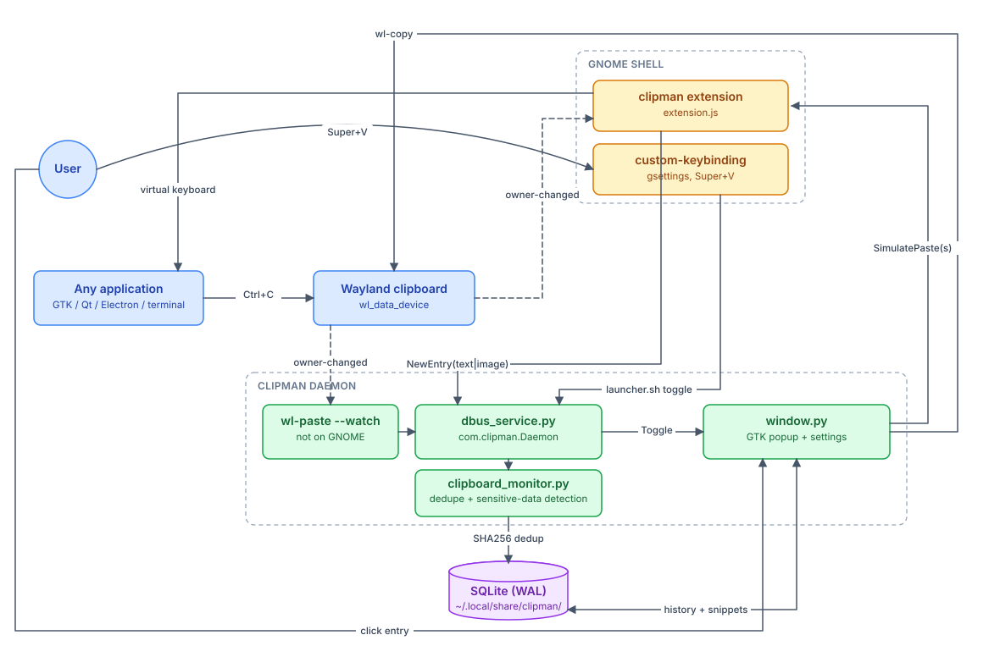
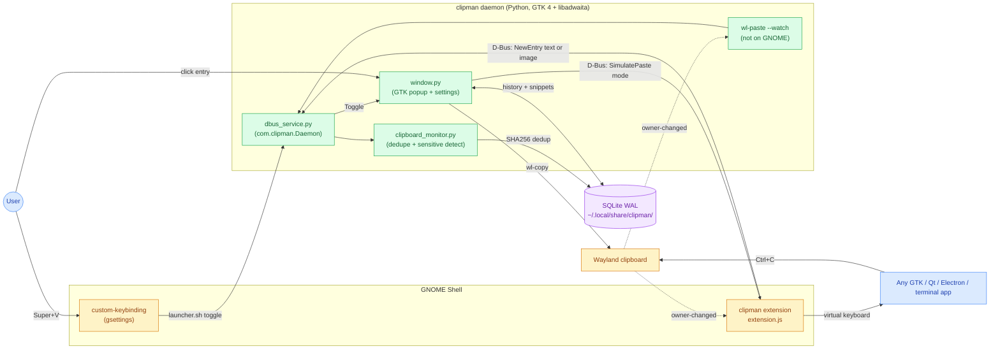

# Architecture

## Overview

Clipman is a Wayland-native clipboard manager built as two cooperating
processes: a GNOME Shell extension that detects clipboard changes
natively via `Meta.Selection`'s `owner-changed` signal, and a Python +
GTK 4 / libadwaita daemon that persists history in a local SQLite
database. The two halves communicate over D-Bus on the session bus,
so there is no polling, no screen flicker, and no telemetry. On GNOME
the extension is required: the daemon's `wl-paste --watch` fallback
cannot run there (see [Fallback path](#fallback-path)).

## Process model

### Daemon

The daemon (`clipman.py` plus the `clipman/` package) is a single
`Adw.Application` running on one GLib main loop. Python 3.10 through
3.14 are supported, with dbus-python and PyGObject providing the
runtime bindings against GTK 4 and libadwaita 1.5+. All clipboard
ingest, database I/O, and GTK signal handling happen on the main
thread; SQLite access is intentionally serialized through the loop
(see the `check_same_thread=False` comment in `clipman/database.py`).

The UI tree is libadwaita-first: `clipman/window.py` builds an
`Adw.ApplicationWindow` with an `Adw.HeaderBar` and a virtualised
`Gtk.ListView` history list of plain `Gtk.Box` rows; `clipman/preferences.py` ships
the settings surface as an `Adw.Dialog` with a navigation sidebar and
six panes
(Appearance, Privacy, Shortcuts, Storage, Updates, About);
`clipman/snippets_dialog.py` is an `Adw.NavigationSplitView`
master-detail editor. The 20 declarative edge states from the
mockups live as `StateSpec` entries in `clipman/edge_states.py` and
are dispatched at render time by `render_edge_state` into one of
`Adw.StatusPage`, `Adw.Banner`, or `Adw.AlertDialog`.
`clipman/window.py` prepends the Catppuccin Mocha (dark) or warm-stone
(light) palette to `clipman/style.css` as `@define-color` overrides of
libadwaita's named colours, so the entire surface picks up the theme
without per-widget CSS.
The package's runtime version literal lives in the leaf module
`clipman/_version.py` and is re-exported from `clipman/__init__.py`,
breaking the cyclic import that would otherwise let submodules
re-enter the package root.

Two background threads are the exceptions: the optional update-check
worker described in
[ADR 0007](docs/adr/0007-in-app-update-notifications.md), which performs
the single anonymous HTTPS request, and a short-lived
`clipman-image-read` thread in `clipman/clipboard_monitor.py`, which
reads an image off the clipboard. Both hand their results back to the
main loop, so no GTK or D-Bus state is touched off-thread.

### Extension

The GNOME Shell extension under `extension/` is an ES module that
loads inside the Shell's gjs process. It is compatible with GNOME
Shell 45 through 51. On clipboard `owner-changed` events the
extension reads the new content via a MIME-type fallback chain
(`text/plain;charset=utf-8` -> `UTF8_STRING` -> `text/plain` ->
`STRING`) and forwards it to the daemon over D-Bus. It also exposes
its own D-Bus surface for the daemon to invoke paste keystrokes and
popup placement (see [IPC contract](#ipc-contract) below).

### Fallback path

When the extension's D-Bus name is missing outside GNOME, the daemon's
`clipman/clipboard_monitor.py` spawns `wl-paste --watch` as a
subprocess and reads new clipboard contents through `wl-paste`. That
needs the data-control protocol, which KDE and wlroots compositors
offer; they are not supported yet
([#318](https://github.com/MohammedEl-sayedAhmed/clipman/issues/318)).
GNOME does not offer it, so when GNOME Shell owns `org.gnome.Shell` the
daemon does not start the watcher: only the extension can record there.

Whenever nothing records copies, `clipman/app.py` works out why and
tells the popup, which shows the matching edge state (`first-run`,
`extension-missing`, `watcher-crashed` or `clipboard-blocked`) until the
problem is solved: as the status page when the history is empty,
otherwise as a banner above the list. The journal gets one warning with
the fix. The daemon follows the extension's bus name, so the popup
updates as soon as the extension starts or stops.

Under snap confinement the daemon skips the watcher. Snap users rely on
the GNOME Shell extension running in their host session and talking to
the snap-confined daemon over the session bus.

## Data model

The store is a single SQLite database at
`~/.local/share/clipman/clipman.db` opened in WAL journal mode. WAL is
used so the popup window can read history concurrently while the
daemon writes new entries arriving from D-Bus callbacks. The schema
lives in `clipman/database.py`:

- `entries` - clipboard history. Columns: `id`, `content_type`
  (`text` or `image`), `content_text`, `image_path`, `content_hash`
  (SHA256, `UNIQUE`), `pinned` (integer flag), `created_at`,
  `accessed_at`, `sensitive`. Pinning is a flag on this table, not a
  separate table. Indexes on `accessed_at DESC` and `content_hash`.
- `snippets` - user-defined named snippets with `id`, `name`,
  `content_text`, `created_at`.
- `settings` - key/value `TEXT` pairs for user preferences (max
  entries, theme, paste mode, update-check toggle, and so on).

Deduplication is content-addressed: every text or image payload is
SHA256-hashed before insert, and an existing row with the same hash is
bumped via `accessed_at` rather than duplicated. Image files are
written into `~/.local/share/clipman/images/` named by their hash, and
the daemon checks their magic bytes (PNG, JPEG, GIF, BMP, WebP) before
persisting. The BMP and WebP checks are loose, and a restore does not
check images ([#335](https://github.com/MohammedEl-sayedAhmed/clipman/issues/335)).

Filesystem permissions are enforced on every startup:

- Data directory and images directory: `0o700` (chmod re-applied on
  startup even if the directory pre-existed).
- Individual image files: `0o600` (created with `os.open` +
  `O_CREAT` and an explicit mode, not `open()`).
- The database file and its WAL and SHM sidecars: `0o600`.

Sensitive entries (detected by `clipman/sensitive.py`) are written with
`sensitive = 1` and deleted by `delete_expired_sensitive` once they are
older than the auto-clear delay: 10 to 300 seconds, 30 by default. The
auto-clear can be switched off, and pinned entries are kept.

## IPC contract

All IPC is on the session bus. The daemon's interface is open to any
process on that bus by design. The extension's interface accepts calls
only from the connection that owns `com.clipman.Daemon`, because it
can type keystrokes and move focus inside the compositor.

### Daemon

- **Bus name:** `com.clipman.Daemon`
- **Object path:** `/com/clipman/Daemon`
- **Interface:** `com.clipman.Daemon`
- **Implementation:** `clipman/dbus_service.py`

| Method                                | Signature    | Description                                                                                                                                                                                                       |
| ------------------------------------- | ------------ | ----------------------------------------------------------------------------------------------------------------------------------------------------------------------------------------------------------------- |
| `Toggle()`                            | `() -> ()`   | Toggles popup visibility. Used by the Super+V keybinding via `launcher.sh`.                                                                                                                                       |
| `Show()`                              | `() -> ()`   | Forces the popup visible.                                                                                                                                                                                         |
| `Hide()`                              | `() -> ()`   | Hides the popup.                                                                                                                                                                                                  |
| `Quit()`                              | `() -> ()`   | Exits the GTK application cleanly.                                                                                                                                                                                |
| `NewEntry(s content_type, s content)` | `(ss) -> ()` | Called by the extension (or by the `wl-paste --watch` fallback) when the clipboard changes. `content_type` is `text` or `image`; `content` is the UTF-8 text, or the empty string for images (which the daemon then reads through `wl-paste --type image/png`). |

### Extension

- **Bus name:** `org.gnome.Shell.Extensions.clipman`
- **Object path:** `/org/gnome/Shell/Extensions/clipman`
- **Interface:** `org.gnome.Shell.Extensions.clipman`
- **Implementation:** `extension/extension.js`

| Method                        | Signature   | Description                                                                                                                                                               |
| ----------------------------- | ----------- | ------------------------------------------------------------------------------------------------------------------------------------------------------------------------- |
| `SimulatePaste(s mode)`       | `(s) -> ()` | Simulates a paste keystroke through a Clutter virtual keyboard. `mode` is one of `auto`, `ctrl-v`, `ctrl-shift-v`, or `shift-insert`; unknown values fall back to `auto`. |
| `MoveWindowToCursor(s title)` | `(s) -> ()` | Moves the daemon's popup (matched by `wm_class`, pid and `title`) to the cursor and gives it focus.                                                                     |
| `RestorePreviousFocus()`      | `() -> ()`  | Gives focus back to the window the user came from, right before the paste.                                                                                                |
| `SetPaused(b paused)`         | `(b) -> ()` | Stops or resumes clipboard reads; the daemon calls it when incognito changes.                                                                                             |

All four methods accept calls only from the connection that owns
`com.clipman.Daemon`; other callers get `AccessDenied`. The
`SimulatePaste(s mode)` argument was added in extension v5. The daemon
calls it with the mode, retries once without it for an older extension,
and shows a "Couldn't auto-paste" dialog when both fail (see
[ADR 0005](docs/adr/0005-paste-mode-as-dbus-arg.md)).

## Trust boundaries

Clipboard data never leaves the machine. Everything described in the
[Data model](#data-model) section is local-only: the SQLite database
lives in the user's home directory with `0o700` permissions, image
files are `0o600`, D-Bus traffic stays on the session bus, and no
subprocess is ever invoked with `shell=True`.

The daemon has exactly one network egress: an opt-out update check
documented in [ADR 0007](docs/adr/0007-in-app-update-notifications.md).
At most once every 24 hours, the update-check thread issues a single
anonymous `GET https://api.github.com/repos/MohammedEl-sayedAhmed/clipman/releases/latest`
with `User-Agent: clipman/<version>` and a 5-second timeout. No
request body, no query parameters, no cookies, no identifiers, no
referrers. The setting is default-ON for source, PyPI, and AUR
installs (where the user is responsible for updates), and default-OFF
for Snap and Flatpak (whose stores already push updates). Users can
toggle it under Settings -> Updates.

Sensitive content detection (`clipman/sensitive.py`: known secret
shapes such as vendor tokens, private keys and labelled passwords) runs
before the entry is persisted. Matching entries are flagged
`sensitive = 1`, masked in the list, and deleted from the database after
the auto-clear delay (30 seconds by default). Search still matches their
hidden text ([#336](https://github.com/MohammedEl-sayedAhmed/clipman/issues/336)). Incognito mode pauses recording
entirely.

No analytics, no crash reporting, no third-party services.

## Architecture diagram

  

Diagram source (Mermaid fallback / text version)

```mermaid
flowchart LR
    classDef user fill:#dbeafe,stroke:#3b82f6,color:#1e40af
    classDef gshell fill:#fef3c7,stroke:#d97706,color:#92400e
    classDef daemon fill:#dcfce7,stroke:#16a34a,color:#166534
    classDef storage fill:#f3e8ff,stroke:#9333ea,color:#6b21a8

    User((User)):::user
    App["Any GTK / Qt / Electron / terminal app"]:::user

    subgraph SHELL ["GNOME Shell"]
        Ext["clipman extension<br/>extension.js"]:::gshell
        KB["custom-keybinding<br/>(gsettings)"]:::gshell
    end

    Clip["Wayland clipboard"]:::gshell

    subgraph DAEMON ["clipman daemon (Python, GTK 4 + libadwaita)"]
        DbusSvc["dbus_service.py<br/>(com.clipman.Daemon)"]:::daemon
        Monitor["clipboard_monitor.py<br/>(dedupe + sensitive detect)"]:::daemon
        Window["window.py<br/>(GTK popup + settings)"]:::daemon
        Fallback["wl-paste --watch<br/>(not on GNOME)"]:::daemon
    end

    DB[("SQLite WAL<br/>~/.local/share/clipman/")]:::storage

    App -->|Ctrl+C| Clip
    Clip -. owner-changed .-> Ext
    Clip -. owner-changed .-> Fallback
    Ext -->|D-Bus: NewEntry text or image| DbusSvc
    Fallback --> DbusSvc

    DbusSvc --> Monitor
    Monitor -->|SHA256 dedup| DB

    User -->|Super+V| KB
    KB -->|launcher.sh toggle| DbusSvc
    DbusSvc -->|Toggle| Window
    Window <-->|history + snippets| DB

    User -->|click entry| Window
    Window -->|wl-copy| Clip
    Window -->|D-Bus: SimulatePaste mode| Ext
    Ext -->|virtual keyboard| App
```

## Decision records

Each notable decision in the sections above is recorded as an ADR
under [`docs/adr/`](docs/adr/):

- ADR-recording process: [ADR 0001](docs/adr/0001-record-architecture-decisions.md)
- CodeQL baseline-ratchet strategy: [ADR 0002](docs/adr/0002-baseline-ratchet-for-codeql.md), refined by [ADR 0008](docs/adr/0008-ratchet-fingerprint-strategy.md)
- SHA-pinned GitHub Actions: [ADR 0003](docs/adr/0003-sha-pin-github-actions.md)
- PyPI publishing via OIDC Trusted Publishing: [ADR 0004](docs/adr/0004-pypi-trusted-publishing-oidc.md)
- D-Bus `SimulatePaste(s mode)` shape and back-compat path: [ADR 0005](docs/adr/0005-paste-mode-as-dbus-arg.md)
- Solo-friendly branch protection: [ADR 0006](docs/adr/0006-solo-friendly-branch-protection.md)
- Update-check privacy posture (the single egress): [ADR 0007](docs/adr/0007-in-app-update-notifications.md)
- Snap on the GNOME extension, with an all-channel weekly refresh: [ADR 0012](docs/adr/0012-snap-gnome-extension-and-all-channel-refresh.md) (supersedes ADR 0009)
- Versioning policy: [ADR 0011](docs/adr/0011-versioning-policy-refresh.md) (supersedes ADR 0010)
