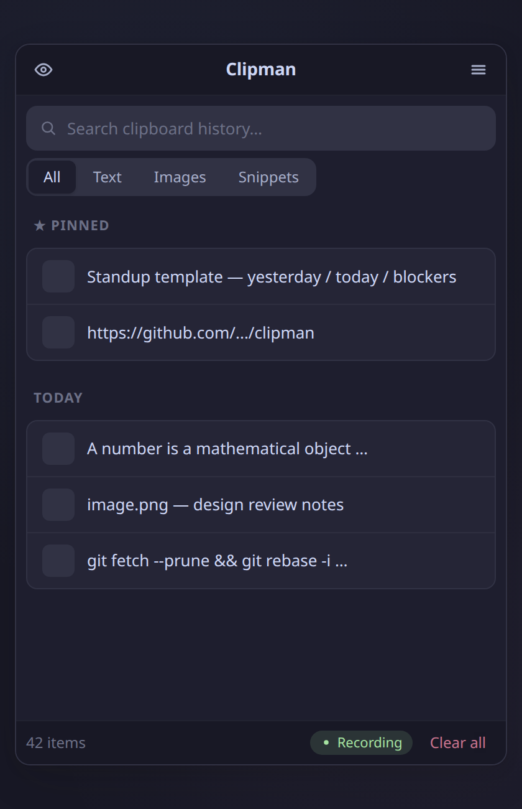
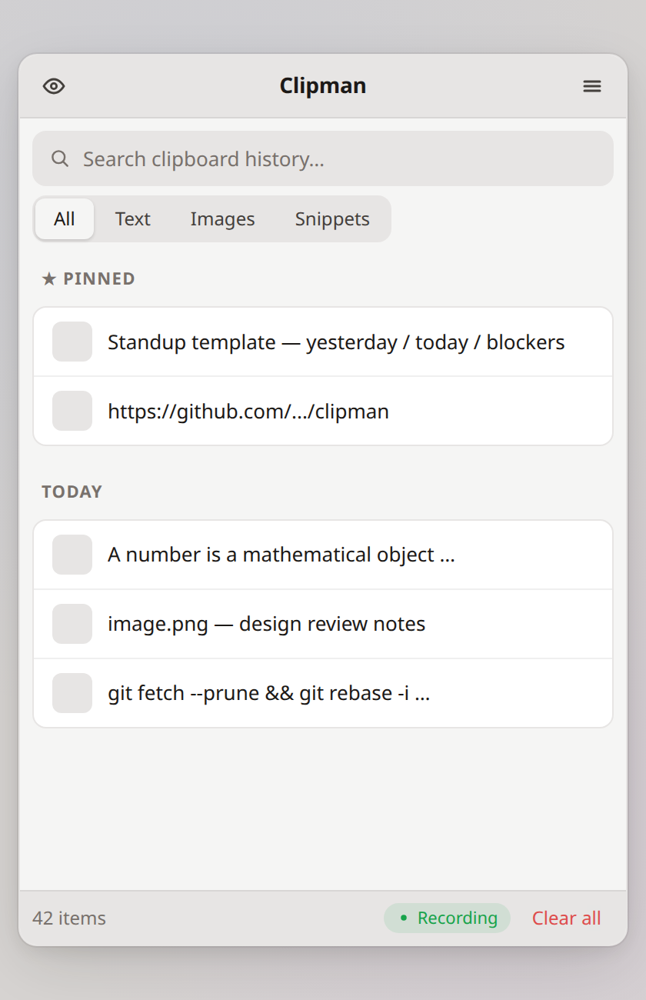

<div align="center">

# Clipman

**A clipboard history manager for Ubuntu/GNOME on Wayland**

Like Windows `Win+V` — but for Linux.

[](LICENSE)
[](https://github.com/MohammedEl-sayedAhmed/clipman/actions)
[](https://github.com/MohammedEl-sayedAhmed/clipman/stargazers)
[](https://github.com/MohammedEl-sayedAhmed/clipman/releases)
[](https://ubuntu.com)
[](https://gnome.org)
[](https://wayland.freedesktop.org)
[](https://python.org)
[](https://pypi.org/project/clipman-clipboard/)
[](https://pypi.org/project/clipman-clipboard/)
[](https://extensions.gnome.org/extension/9407/clipman-clipboard-monitor/)
[](https://aur.archlinux.org/packages/clipman-clipboard)
[](https://snapcraft.io/clipman)
[](https://github.com/sponsors/MohammedEl-sayedAhmed)
[](https://www.paypal.com/paypalme/mohammedelsayedammar)
[](https://github.com/MohammedEl-sayedAhmed/clipman/discussions)

---

Press **Super+V** to view your clipboard history, search entries, pin favorites, and instantly paste previous copies.

<br>

&nbsp;&nbsp;

</div>

---

Clipman is a **Wayland-native** clipboard manager built on a GNOME Shell extension — no polling, no subprocesses, no screen flicker. It detects clipboard changes through `Meta.Selection` signals and communicates over D-Bus, making it fundamentally different from tools that rely on `wl-paste --watch` or timer-based polling. Privacy is built in: incognito mode, automatic sensitive data detection with 30-second auto-clear, and restrictive file permissions. The entire app is Python + GTK3 — no Electron, no heavy frameworks.

---

## Features

### Clipboard

- **Text and image support** — stores both content types with SHA256 deduplication
- **Full-text search** — instantly filter history by content
- **Pin favorites** — keep important entries permanently, exempt from pruning
- **Filter tabs** — switch between All, Text, Images, and Snippets views
- **Snippet templates** — save reusable text blocks for quick pasting
- **Date grouping** — entries organized into Today, Yesterday, and Older sections
- **Inline editing** — edit any text entry directly from the history
- **Preview expansion** — expand long entries inline to see full content
- **URL detection** — auto-detected with a one-click open button
- **Character count** — text entries show a character count badge
- **Image preview** — hover for a larger tooltip preview
- **Auto-pruning** — history capped at a configurable limit (pinned entries exempt)

### Keyboard

| Key | Action |
|-----|--------|
| <kbd>Super</kbd> + <kbd>V</kbd> | Toggle the popup |
| <kbd>Arrow</kbd> keys | Navigate entries |
| <kbd>Enter</kbd> | Paste selected entry |
| <kbd>Shift</kbd> + <kbd>Enter</kbd> | Copy without pasting |
| <kbd>P</kbd> | Pin / unpin selected entry |
| <kbd>Delete</kbd> | Delete selected entry |
| <kbd>Escape</kbd> | Close popup |

### Appearance

- **Dark and light themes** — Catppuccin Mocha and Catppuccin Latte
- **Font customization** — adjustable size (8–20px) and 6 color presets (Green, Peach, Mauve, Pink, Teal)
- **Window opacity** — configurable transparency from 30% to 100%

### Privacy and Security

- **Incognito mode** — pause clipboard recording entirely
- **Sensitive data detection** — tokens and passwords auto-detected and cleared after 30 seconds
- **Restrictive permissions** — data directory `0o700`, image files `0o600`
- **Path traversal protection** — all image paths validated before file operations
- **Backup validation** — imported databases checked for schema integrity and sanitized
- **Parameterized SQL** — no injection vectors
- **No shell execution** — all subprocesses use argument lists, never `shell=True`

### Integration

- **Terminal-aware paste** — sends <kbd>Ctrl</kbd>+<kbd>Shift</kbd>+<kbd>V</kbd> in terminal emulators, <kbd>Ctrl</kbd>+<kbd>V</kbd> elsewhere
- **XWayland support** — clipboard detection for VSCode, Electron, and other XWayland apps via MIME type fallback
- **Systemd autostart** — runs as a background daemon, auto-restarts on crash
- **Backup and restore** — export and import your clipboard database from settings
- **GNOME Shell extension** — native clipboard monitoring with zero overhead

### Performance

- **Zero polling** — event-driven via `Meta.Selection` signals and D-Bus
- **SHA256 deduplication** — copying the same content bumps it to the top without creating duplicates
- **Configurable history** — 50 to 5,000 entries
- **Lightweight** — Python + GTK3, no Electron or heavy frameworks

## Requirements

- Ubuntu 22.04+ with GNOME 46–48 and Wayland
- Python 3.10+
- GTK 3

> Dependencies are installed automatically by the install script.

## Quick Start

```bash
# Clone the repo
git clone https://github.com/MohammedEl-sayedAhmed/clipman.git
cd clipman

# Install dependencies, extension, keybinding, systemd service, and autostart
./install.sh

# Log out and back in to activate the GNOME Shell extension

# Start the daemon (runs automatically on next login)
systemctl --user start clipman.service
```

The systemd service auto-restarts on crash and starts automatically on login.

### Alternative Installation

<details>
<summary><strong>PyPI</strong></summary>

```bash
pip install clipman-clipboard
```

</details>

<details>
<summary><strong>GNOME Shell Extension</strong> (installed automatically by install.sh)</summary>

The companion extension is required for clipboard detection. It is installed automatically by the install script, but can also be installed manually from [GNOME Extensions](https://extensions.gnome.org/extension/9407/clipman-clipboard-monitor/):

```bash
gnome-extensions install clipman-extension.zip
```

</details>

<details>
<summary><strong>Flatpak</strong></summary>

A Flatpak manifest is included for building with GNOME 47 runtime. To build locally:

```bash
flatpak-builder --user --install build com.clipman.Clipman.json
```

</details>

<details>
<summary><strong>Snap</strong></summary>

```bash
sudo snap install clipman
```

Or build locally:

```bash
snapcraft
sudo snap install clipman_*.snap --dangerous
```

</details>

<details>
<summary><strong>AUR (Arch Linux)</strong></summary>

```bash
yay -S clipman-clipboard
```

Or with paru: `paru -S clipman-clipboard`

</details>

## Usage

| Action | How |
|--------|-----|
| Open clipboard history | <kbd>Super</kbd> + <kbd>V</kbd> |
| Paste an entry | Click on it or press <kbd>Enter</kbd> |
| Copy without pasting | <kbd>Shift</kbd> + <kbd>Enter</kbd> |
| Pin / unpin an entry | Click the star icon or press <kbd>P</kbd> |
| Delete an entry | Click the X icon or press <kbd>Delete</kbd> |
| Filter by type | Click **All**, **Text**, **Images**, or **Snippets** tabs |
| Create a snippet | Switch to **Snippets** tab and click **+ Add** |
| Search history | Type in the search bar |
| Edit a text entry | Click the edit icon on any text entry |
| Expand long text | Click the expand icon to see full content |
| Open a URL | Click the arrow icon on URL entries |
| Toggle incognito | Click the eye icon in the status bar |
| Clear all unpinned | Click **Clear All** |
| Close popup | <kbd>Escape</kbd> or click outside |

### Settings

Click the gear icon to access settings:

| Setting | Description |
|---------|-------------|
| **Opacity** | Window transparency (30%–100%) |
| **Font size** | Text size for entries (8–20px) |
| **Max history** | Number of entries to keep (50–5,000) |
| **Theme** | Toggle between Dark and Light themes |
| **Font color** | Choose from Default, Green, Peach, Mauve, Pink, or Teal |
| **Data** | Backup or restore your clipboard database |

Settings are saved automatically and persist across sessions.

## How It Works

1. A **GNOME Shell extension** detects clipboard changes natively via `Meta.Selection`'s `owner-changed` signal — no polling, no subprocesses, no screen flicker
2. The extension reads the content using a **MIME type fallback chain** (`text/plain;charset=utf-8` → `UTF8_STRING` → `text/plain` → `STRING`) and sends it to the daemon over **D-Bus**
3. The daemon stores entries in an **SQLite database** (WAL mode) at `~/.local/share/clipman/`
4. Duplicates are detected via **SHA256 hashing** — copying the same content updates the timestamp and bumps it to the top
5. Pressing **Super+V** sends a **D-Bus toggle** to the daemon, which shows the popup window near the cursor
6. Clicking an entry copies it via `wl-copy`, hides the popup, and the extension simulates a **paste keystroke** using a Clutter virtual keyboard

<details>
<summary><strong>Project structure</strong></summary>

```
clipman/
├── clipman.py                     # Entry point (start daemon / toggle popup)
├── clipman/
│   ├── __init__.py                # i18n/gettext setup
│   ├── app.py                     # GTK Application lifecycle
│   ├── clipboard_monitor.py       # Event-driven clipboard monitor
│   ├── database.py                # SQLite storage with dedup/search/pin/snippets
│   ├── dbus_service.py            # D-Bus IPC for toggle and clipboard events
│   ├── window.py                  # GTK3 popup window UI
│   └── style.css                  # CSS theme template (Catppuccin, $variable syntax)
├── extension/
│   ├── extension.js               # GNOME Shell extension (clipboard detection + paste)
│   └── metadata.json              # Extension metadata
├── data/
│   ├── com.clipman.Clipman.desktop
│   ├── com.clipman.Clipman.svg    # App icon
│   ├── com.clipman.Clipman.metainfo.xml  # AppStream metadata
│   └── clipman.service            # Systemd user service
├── po/
│   ├── POTFILES.in                # Files with translatable strings
│   └── clipman.pot                # Translation template (70 strings)
├── tests/
│   ├── test_database.py           # Database unit tests (70 tests)
│   ├── test_clipboard_monitor.py  # Monitor unit tests (58 tests)
│   └── test_window_utils.py       # URL detection & time formatting (22 tests)
├── docs/
│   ├── dark-theme.png             # Screenshot (dark theme)
│   └── light-theme.png            # Screenshot (light theme)
├── com.clipman.Clipman.json       # Flatpak manifest
├── snap/
│   └── snapcraft.yaml             # Snap packaging
├── .github/
│   └── workflows/test.yml         # CI — runs 150 tests on Python 3.10–3.12
├── launcher.sh                    # Environment wrapper for snap terminals
├── install.sh
├── uninstall.sh
├── CONTRIBUTING.md
├── CHANGELOG.md
└── LICENSE / NOTICE
```

</details>

## Troubleshooting

**Extension not loading after install**
Log out and back in. GNOME Shell extensions require a session restart to activate.

**Super+V doesn't open Clipman**
The install script reassigns Super+V from GNOME's message tray. Check for conflicts:
```bash
gsettings get org.gnome.shell.keybindings toggle-message-tray
```
If it still shows `<Super>v`, the keybinding wasn't reassigned. Re-run `./install.sh`.

**XWayland apps (VSCode, Electron) not detected**
Verify the extension is enabled:
```bash
gnome-extensions list --enabled | grep clipman
```
If missing, enable it with `gnome-extensions enable clipman@clipman.com` and log out/in.

**Pasting shows `^V` in VSCode/Electron integrated terminals**
Clipman auto-pastes with Ctrl+V, which standalone terminals interpret correctly. However, integrated terminals inside editors (VSCode, Cursor) expect Ctrl+Shift+V. Use **Shift+Enter** in Clipman to copy without auto-pasting, then manually Ctrl+Shift+V in the terminal.

**Daemon not starting**
Check the service status:
```bash
systemctl --user status clipman.service
journalctl --user -u clipman.service -n 20
```

## Contributing

Contributions are welcome. See [CONTRIBUTING.md](CONTRIBUTING.md) for setup instructions, project structure, coding guidelines, and how to run the test suite (150 tests, no GTK or D-Bus required).

## Uninstall

```bash
./uninstall.sh
```

This stops the systemd service and removes the GNOME Shell extension, keybinding, systemd service, app icon, and optionally your clipboard history data.

## License

Copyright 2025–2026 Mohammed El-sayed Ahmed

Licensed under the **Apache License, Version 2.0**. You may use, modify, and distribute this software, provided you:

- Include the original [LICENSE](LICENSE) and [NOTICE](NOTICE) files
- Give appropriate credit to the original author
- State any changes you made

See the [LICENSE](LICENSE) and [NOTICE](NOTICE) files for full details.

## Acknowledgements

- Theme palette by [Catppuccin](https://github.com/catppuccin/catppuccin)
- CI powered by [GitHub Actions](https://github.com/features/actions)
