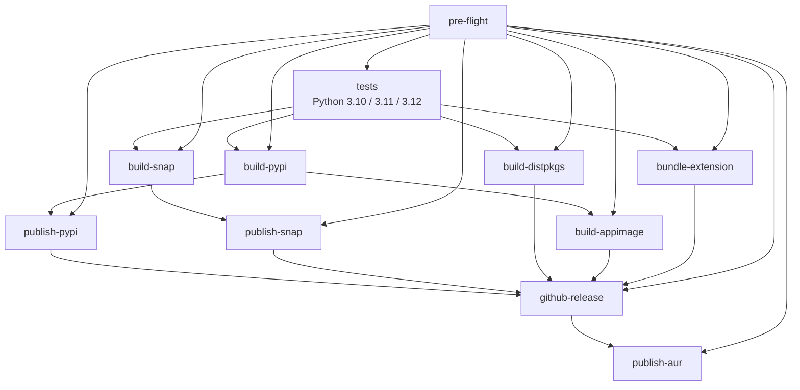

# CI / CD

A reference for the project's continuous-integration and release
pipelines. Every workflow under `.github/workflows/` is inventoried
here with its trigger, purpose, and whether it's a required check
on `main`.

## Workflow inventory

| Workflow | File | Triggers | Purpose | Required check on `main`? |
|----------|------|----------|---------|---------------------------|
| Baseline guard | `baseline-guard.yml` | `push` to `security-baseline` branch | Auto-reverts unauthorized pushes to the security-baseline branch and opens a high-priority security issue; the branch is meant to be written only by the `update-baseline` job in `codeql.yml`. | No (operates on a side branch) |
| CodeQL | `codeql.yml` | `push` to `main`, `pull_request` to `main`, weekly cron (`27 4 * * 1`), `workflow_dispatch` | Runs `security-and-quality` CodeQL queries for Python and JavaScript; on PRs ratchets against the `security-baseline` branch; on push to `main` rebuilds the baseline from the fresh SARIF. | Yes — `Analyze (python)` and `Analyze (javascript)` |
| Dependency review | `dependency-review.yml` | `pull_request` to `main` | Fails the PR on high-severity vulnerabilities or disallowed licenses introduced by dependency changes. | No (informational; no contexts on protection ruleset) |
| Auto-label PR | `labeler.yml` | `pull_request_target` to `main` | Applies path-based labels from `.github/labeler.yml` so triage knows which area a PR touches. | No |
| Sync labels | `labels.yml` | `push` to `main` touching `.github/labels.yml`, `workflow_dispatch` | Reconciles repository labels with the declarative `.github/labels.yml` source of truth. | No (push-only) |
| Lint | `lint.yml` | `push` to `main`, `pull_request` to `main` | `ruff check clipman tests` for Python and `shellcheck` for `install.sh` / `uninstall.sh` / `launcher.sh`. | Yes — `Python (ruff)` and `Shell (shellcheck)` |
| Release | `release.yml` | `push` of tag matching `v*.*.*`, `workflow_dispatch` | End-to-end release pipeline: pre-flight version checks, matrix tests, builds (PyPI, snap, .deb/.rpm, AppImage, extension bundle), and publishes to PyPI, Snap Store, AUR, and GitHub Releases. | No (tag-triggered only) |
| Scorecard | `scorecard.yml` | `push` to `main`, weekly cron (`37 4 * * 1`), `branch_protection_rule` | OSSF Scorecard supply-chain analysis; uploads SARIF to the GitHub Security tab and publishes results. | No |
| Secret scan | `secret-scan.yml` | `push` to `main`, `pull_request` to `main` | Runs `gitleaks` over full git history to catch committed credentials. | Yes — `gitleaks` |
| Snap refresh | `snap-refresh.yml` | Weekly cron (`0 4 * * 1`), `workflow_dispatch`, `push`/`pull_request` to `main` touching snap-relevant paths | Rebuilds the snap to pick up Ubuntu archive security updates; can publish to the Snap Store on the scheduled run. See ADR 0009. | No |
| Tests | `test.yml` | `push` to `main`, `pull_request` to `main` | `python -m unittest discover -s tests` across the Python 3.10 / 3.11 / 3.12 matrix on `ubuntu-24.04`. | Yes — `test (3.10)`, `test (3.11)`, `test (3.12)` |

The remaining required context on `main` is `review`, which is enforced
by the protection ruleset itself rather than by a workflow file.

## Release pipeline end-to-end

`release.yml` is structured as a DAG: pre-flight gates the matrix
tests, which then fan out into the parallel build jobs, which in turn
gate the parallel publish jobs.



Per-job notes (consult `release.yml` for the authoritative `needs:`
graph and step contents):

- **pre-flight** — checks that the pushed tag, `pyproject.toml`
  `version`, and `snap/snapcraft.yaml` `version` all agree, and
  extracts the matching `[X.Y.Z]` section from `CHANGELOG.md` to use
  as the GitHub Release body. A mismatch fails the entire pipeline
  before any artifacts are built.
- **tests** — fan-out matrix on `ubuntu-24.04` for Python 3.10, 3.11,
  and 3.12. `fail-fast: true` so a regression in one interpreter
  short-circuits the whole pipeline.
- **build-pypi** — `python -m build` produces sdist + wheel uploaded
  as the `pypi-dist` artifact.
- **publish-pypi** — `pypa/gh-action-pypi-publish` with OIDC trusted
  publishing per ADR 0004; no long-lived PyPI token is stored. The
  job runs in the `pypi` environment so the trusted-publisher binding
  resolves.
- **build-snap** — `snapcore/action-build` builds the `.snap`.
- **publish-snap** — uploads to the Snap Store `stable` channel via
  `snapcore/action-publish`. Requires `SNAPCRAFT_STORE_CREDENTIALS`;
  if the secret is unset, the job logs a warning and skips the
  publish step rather than failing.
- **build-distpkgs** — fpm-based builder produces a `.deb` and a
  `.rpm` from a staged filesystem tree (reshaped in PR #29).
- **build-appimage** — `python-appimage` pinned to `1.4.5` (PR #37)
  bundles the wheel with a Python 3.12 runtime. The Ubuntu 24.04
  runner installs `libfuse2t64` with a fallback to `libfuse2`
  (PR #33). The build step is allowed to fail with a warning rather
  than block the pipeline because Python+GTK packaging is brittle.
- **bundle-extension** — `gnome-extensions pack` produces a
  versioned `clipman-extension-vX.Y.Z.zip` for the GNOME Extensions
  website upload (manual; EGO has no programmatic upload API).
- **github-release** — `softprops/action-gh-release` assembles the
  artifacts under `release-assets/` and creates the Release with the
  pre-flight-extracted CHANGELOG section as the body.
  `fail_on_unmatched_files: false` lets the release ship without the
  AppImage glob match if `build-appimage` skipped its upload.
- **publish-aur** — clones `ssh://aur@aur.archlinux.org/clipman-clipboard.git`,
  copies the refreshed `aur/PKGBUILD` and `aur/.SRCINFO` produced by
  `scripts/update-aur.sh`, and pushes. Requires `AUR_SSH_PRIVATE_KEY`;
  missing-secret falls through to a warning and skip (PR #39).

Relevant historical PRs for context: PR #29 (release pipeline
reshape), PR #33 (libfuse2t64 fix in AppImage build), PR #36 (twine
v1.12.2 to v1.14.0 pin fix — see "SHA-pinning policy" below),
PR #37 (python-appimage pin to 1.4.5), PR #38 (`scripts/update-aur.sh`
and PKGBUILD refresh), PR #39 (AUR auto-publish wiring).

## Secrets matrix

| Secret | Required for | How to add | Rotation | Graceful skip |
|--------|--------------|------------|----------|---------------|
| (none — OIDC trusted publishing) | `publish-pypi` | Configured once at <https://pypi.org/manage/account/publishing/> against project `clipman-clipboard`, repo `clipman`, workflow `release.yml`, environment `pypi`. See ADR 0004. | n/a (no long-lived secret) | `publish-pypi` fails — investigate the trusted-publisher binding. |
| `SNAPCRAFT_STORE_CREDENTIALS` | `publish-snap` in `release.yml`, `publish` job in `snap-refresh.yml` | `snapcraft export-login --acls package_access,package_push,package_release,package_update` then paste into repo secrets. | Yearly. Snap Store emails a reminder roughly 30 days before expiry. | `publish-snap` and `snap-refresh` `publish` log `::warning::` and skip — the build artifact is still uploaded for manual review. |
| `AUR_SSH_PRIVATE_KEY` | `publish-aur` in `release.yml` | ed25519 keypair; register the public key on the AUR maintainer account and paste the private key into repo secrets. | As needed (compromise, account change). | `publish-aur` logs a `::warning::` and skips the push; no release artifacts are affected. |
| `GITHUB_TOKEN` | Every workflow | Built-in; nothing to add. | Rotated per-job by GitHub. | n/a — token always present. Each workflow declares the minimum `permissions:` block it needs (deny-by-default at the workflow level). |

To reconfirm the exact set of secret names declared in the workflows:

```bash
grep -RhoE "secrets\.[A-Z_]+" .github/workflows/ | sort -u
```

As of v1.0.6 that returns `secrets.AUR_SSH_PRIVATE_KEY`,
`secrets.GITHUB_TOKEN`, and `secrets.SNAPCRAFT_STORE_CREDENTIALS`.

## SHA-pinning policy

All third-party GitHub Actions are pinned to commit SHAs per
[ADR 0003](adr/0003-sha-pin-github-actions.md). The pin must be the
**commit SHA**, not the SHA of the annotated tag object that points
at the commit. The two are different objects in git's object store
and resolve differently — most importantly, Docker-based actions
fetch by the tag-or-SHA reference and fail with `Unable to find image`
when given an annotated-tag SHA.

This distinction bit us in v1.0.5: `pypa/gh-action-pypi-publish` was
pinned to the annotated-tag-object SHA, and the PyPI publish failed
with `Unable to find image`. PR #36 corrected the pin shape (and
bumped the action from v1.12.2 to v1.14.0 along the way).

Illustrative shape (verify the current pins by reading `release.yml`
directly):

```yaml
# Wrong: annotated-tag-object SHA; Docker-based actions fail with
# "Unable to find image" because that SHA does not refer to a commit.
- uses: pypa/gh-action-pypi-publish@<annotated-tag-sha>

# Right: commit SHA from `git rev-parse <tag>^{commit}`
- uses: pypa/gh-action-pypi-publish@cef221092ed1bacb1cc03d23a2d87d1d172e277b # v1.14.0
```

To resolve a tag to its commit SHA before pinning:

```bash
git ls-remote https://github.com/pypa/gh-action-pypi-publish refs/tags/v1.14.0
# or, if the repo is already cloned:
git rev-parse v1.14.0^{commit}
```

Dependabot's weekly `github-actions` ecosystem updates keep the pins
current. Review each Dependabot PR to confirm the new pin is a
commit SHA, not a tag-object SHA, before merging.

## Branch protection and required checks

Required status checks on `main` (from
`gh api repos/MohammedEl-sayedAhmed/clipman/branches/main/protection`):

- `Analyze (javascript)` — from `codeql.yml`
- `Analyze (python)` — from `codeql.yml`
- `Python (ruff)` — from `lint.yml`
- `Shell (shellcheck)` — from `lint.yml`
- `gitleaks` — from `secret-scan.yml`
- `review` — auto-label / review-gating context
- `test (3.10)` — from `test.yml`
- `test (3.11)` — from `test.yml`
- `test (3.12)` — from `test.yml`

Other ruleset settings:

- `required_linear_history`: enabled (rebase or squash merges only,
  no merge commits).
- `allow_force_pushes`: disabled.
- `allow_deletions`: disabled.
- `required_conversation_resolution`: enabled.
- `enforce_admins`: disabled (so the maintainer can break glass
  without disabling the rule).
- `required_signatures`: disabled.

Rationale: linear history plus the required-check list plus no
force-push on `main`, but no required reviewer because this is a
single-maintainer project — see
[ADR 0006](adr/0006-solo-friendly-branch-protection.md).

## Debugging a failing workflow

Ranked playbook, cheapest first.

1. **Read the failed step's log.** The CodeQL ratchet, the AppImage
   build, and any third-party action that has shifted behaviour will
   surface a useful annotation here.

   ```bash
   gh run view <run-id> --log-failed
   ```

2. **Confirm the required secrets are populated.** A missing
   `SNAPCRAFT_STORE_CREDENTIALS` or `AUR_SSH_PRIVATE_KEY` is the
   intended graceful-skip path; if `publish-pypi` fails the cause is
   the OIDC trusted-publisher binding, not a secret.

   ```bash
   gh secret list
   ```

3. **Suspect transient infrastructure.** Sigstore Rekor, the PyPI
   upload endpoint, the Snap Store, and (rarely) the AUR SSH endpoint
   can flake. Re-run only the failed jobs to avoid burning runner
   minutes on the matrix jobs that already passed.

   ```bash
   gh run rerun <run-id> --failed
   ```

4. **Check for a yanked or shifted action.** SHA pins prevent silent
   shifts in practice (ADR 0003), but a Dependabot bump can introduce
   one. Inspect the diff in the Dependabot PR or `git blame` the
   `uses:` line to confirm the pin matches the version comment.

5. **Check the CodeQL baseline branch.** If `Update baseline on push
   to main` is stuck, the fingerprint ratchet may have drifted — see
   [ADR 0008](adr/0008-ratchet-fingerprint-strategy.md) and
   [ADR 0002](adr/0002-baseline-ratchet-for-codeql.md). Manual
   tampering with the `security-baseline` branch is auto-reverted by
   `baseline-guard.yml`; if a legitimate baseline change is needed,
   land it through a normal PR that adjusts the rule set or
   suppression list rather than rewriting the branch directly.

## Adding a new workflow

Start from the shape of `lint.yml` or `test.yml`:

- `permissions: {}` at the workflow level (deny-by-default; opt in
  per-job to the narrowest scope needed).
- First step in every job: `step-security/harden-runner` pinned to a
  commit SHA with `egress-policy: audit`.
- Pin every third-party action to a commit SHA with the version as a
  trailing comment (ADR 0003).
- A `concurrency:` group keyed on `github.workflow` and the relevant
  ref (`github.ref` for branch-scoped, `github.event.pull_request.number`
  for PR-scoped) to drop duplicate runs.
- An explicit `timeout-minutes:` on each job to bound runaway runs.
- `persist-credentials: false` on `actions/checkout` unless the job
  legitimately needs to push back to the repo.

If the new workflow is meant to gate releases, add its context to the
branch-protection ruleset under "Required status checks". Otherwise
leave it as informational and rely on the ratchet/review path.

Cross-references:

- [ADR 0003 — SHA-pin GitHub Actions](adr/0003-sha-pin-github-actions.md)
- [ADR 0006 — Solo-friendly branch protection](adr/0006-solo-friendly-branch-protection.md)

## Related ADRs

- [ADR 0002 — Baseline-ratchet for CodeQL](adr/0002-baseline-ratchet-for-codeql.md)
- [ADR 0003 — SHA-pin GitHub Actions](adr/0003-sha-pin-github-actions.md)
- [ADR 0004 — PyPI trusted publishing via OIDC](adr/0004-pypi-trusted-publishing-oidc.md)
- [ADR 0006 — Solo-friendly branch protection](adr/0006-solo-friendly-branch-protection.md)
- [ADR 0008 — Ratchet fingerprint strategy](adr/0008-ratchet-fingerprint-strategy.md)
- [ADR 0009 — Weekly snap rebuild cadence](adr/0009-snap-rebuild-cadence.md)
