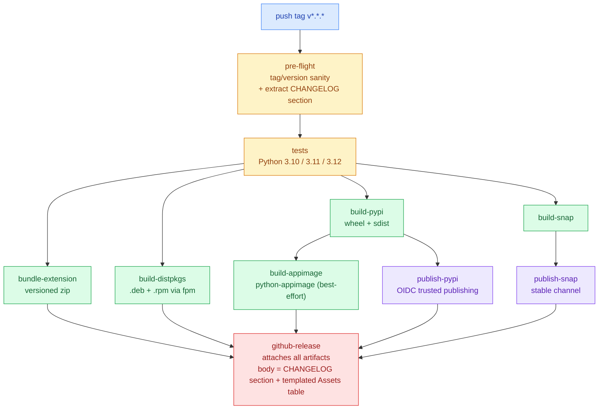

# Release notes

GitHub Releases are the authoritative home for Clipman's release notes.
They are **auto-generated** by `.github/workflows/release.yml` from the
matching `## [x.y.z]` section in `CHANGELOG.md` whenever a `v*.*.*` tag
is pushed.

## How a release happens

1. Bump versions with `./scripts/bump-version.sh <new-version>` —
   updates `pyproject.toml`, `snap/snapcraft.yaml`, and `aur/PKGBUILD`
   in one shot.
2. Rename the `## [Unreleased]` section in `CHANGELOG.md` to
   `## [<new-version>] - YYYY-MM-DD`.
3. Commit, tag (`git tag v<new-version>`), and push (`git push --tags`).
4. The `release.yml` workflow takes over — see the diagram below.

## Pipeline shape

## Release assets

| Filename | Format | Channel |
|----------|--------|---------|
| `clipman_clipboard-*.whl` | PyPI wheel | PyPI auto-publish; users do `pip install --upgrade clipman-clipboard` |
| `clipman_clipboard-*.tar.gz` | PyPI sdist | PyPI auto-publish; source-build install |
| `clipman_*.snap` | Snap package | Snap Store stable auto-publish; offline install via `snap install --dangerous` |
| `clipman_*_all.deb` | Debian/Ubuntu native | `sudo apt install ./clipman_*_all.deb` |
| `clipman-*.noarch.rpm` | Fedora/RHEL native | `sudo dnf install ./clipman-*.noarch.rpm` |
| `clipman-*-x86_64.AppImage` | Portable Linux binary (Python-only bundle) | `chmod +x ./clipman-*.AppImage && ./clipman-*.AppImage` — still needs system `python3-gi` |
| `clipman-extension-*.zip` | GNOME Shell extension | manual upload at <https://extensions.gnome.org/upload/> (no EGO API) |
| `Source code (zip / tar.gz)` | git tree at the tag | auto-generated by GitHub |

### Install caveats

- **`.deb` and `.rpm`** install the daemon, the Python module, the
  `.desktop` file, and the icon. They do **not** install the per-user
  GNOME Shell extension or register the `Super+V` keybinding (those
  live in `$HOME` and `gsettings`). After installing the package,
  run `install.sh` from a source checkout — or do the per-user steps
  manually — to enable the extension + keybinding.
- **AppImage** bundles a Python 3.12 runtime and the clipman wheel.
  It does **not** bundle GTK or PyGObject. The user still needs
  `python3-gi` and `gir1.2-gtk-3.0` (or distro equivalents) installed
  system-wide. Bundling GTK fully in an AppImage is technically
  possible but historically fragile; for a self-contained install the
  Snap and Flatpak builds are better choices.
- **GNOME Extensions website (EGO)** has no public upload API. The
  release pipeline builds the extension zip and attaches it; the
  maintainer manually uploads via the web UI at
  <https://extensions.gnome.org/upload/>.

## Why CHANGELOG.md drives the release body

- One source of truth: `CHANGELOG.md` ships with the source tarball
  and PyPI sdist, so users who never visit the GitHub UI still see the
  same notes.
- Reviewable in a PR: release notes are part of the diff that lands on
  `main`, not a free-text field edited after the fact.
- Auditable: the tag's release body is exactly the section that was
  committed at the tag — no out-of-band edits.

## Related decisions

- **ADR 0004** — *PyPI publishing via OIDC trusted publishing*. The
  `publish-pypi` job has no long-lived token; PyPI must have a
  matching trusted-publisher entry registered manually.
- **ADR 0003** — *Pin all third-party GitHub Actions to commit SHAs*.
  Every action in `release.yml` is SHA-pinned with a version comment.
- **ADR 0006** — *Solo-friendly branch protection on `main`*. The
  same required status checks gate the commit that the release tag
  points at.
