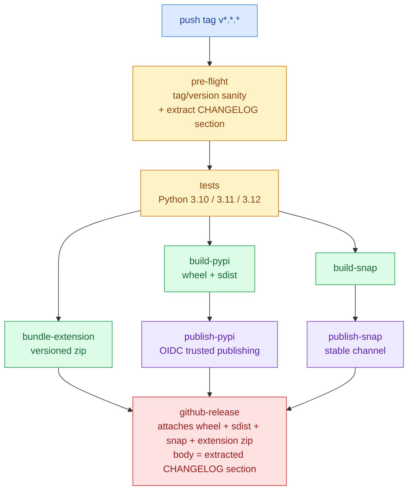

# Release notes

GitHub Releases are the authoritative home for Clipman's release notes.
They are **auto-generated** by `.github/workflows/release.yml` from the
matching `## [x.y.z]` section in `CHANGELOG.md` whenever a `v*.*.*` tag
is pushed.

## How a release happens

1. Bump versions with `./scripts/bump-version.sh <new-version>` —
   updates `pyproject.toml`, `snap/snapcraft.yaml`, `flathub/*.json`,
   and `aur/PKGBUILD` in one shot.
2. Rename the `## [Unreleased]` section in `CHANGELOG.md` to
   `## [<new-version>] - YYYY-MM-DD`.
3. Commit, tag (`git tag v<new-version>`), and push (`git push --tags`).
4. The `release.yml` workflow takes over — see the diagram below.

## Pipeline shape

## Why CHANGELOG.md drives the release body

- One source of truth: `CHANGELOG.md` ships with the source tarball
  and PyPI sdist, so users who never visit the GitHub UI still see the
  same notes.
- Reviewable in a PR: release notes are part of the diff that lands on
  `main`, not a free-text field edited after the fact.
- Auditable: the tag's release body is exactly the section that was
  committed at the tag — no out-of-band edits.

## Related decisions

- **ADR 0004** — *PyPI publishing via OIDC trusted publishing*. The
  `publish-pypi` job has no long-lived token; PyPI must have a
  matching trusted-publisher entry registered manually.
- **ADR 0003** — *Pin all third-party GitHub Actions to commit SHAs*.
  Every action in `release.yml` is SHA-pinned with a version comment.
- **ADR 0006** — *Solo-friendly branch protection on `main`*. The
  same required status checks gate the commit that the release tag
  points at.
